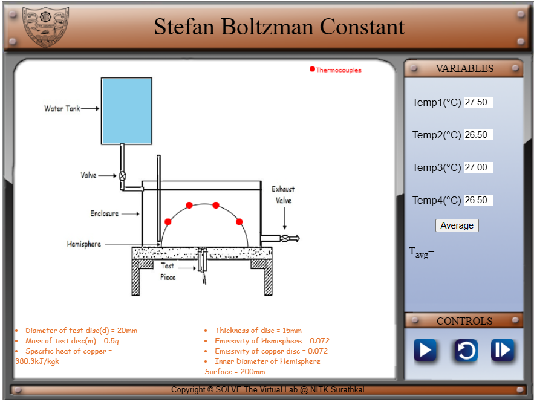
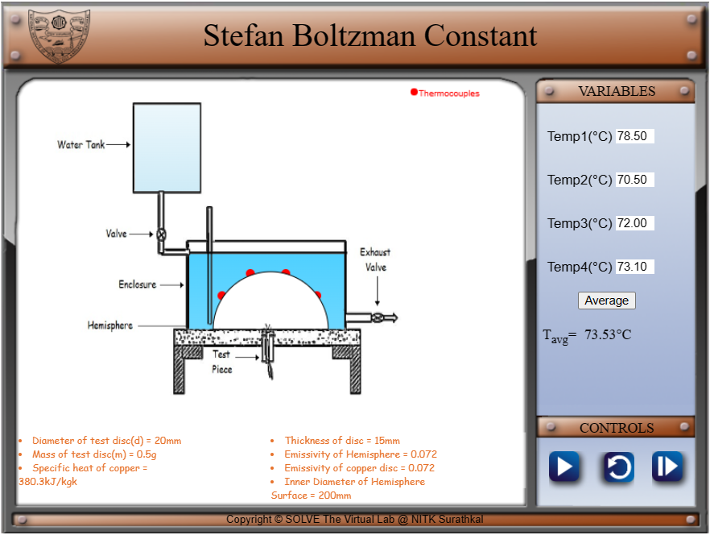
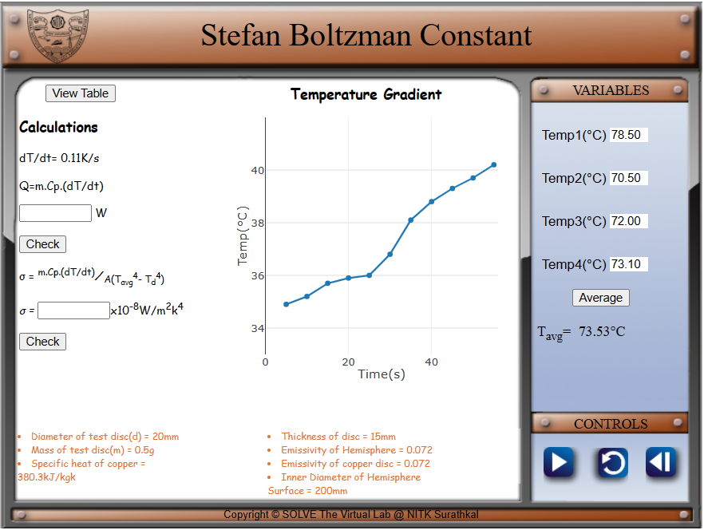

1. Clicking on the simulation tab will open the first stage of simulator where water is still in the tank

2. Clicking on the play button will start the experiment where the heated water will flow into the enclosure. The temperatures on the thermocouples will start at room temperature and reach to a steady state temperature. 

3. Clicking on the next button will show a graph which shows the rise in temperature for every five seconds. The user can calculate the heat transfer and Stefan Boltzmann constant to validate the experiment.

Clicking on the reset button in middle will restart the experiment.