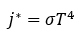
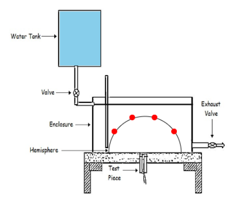

The Stefan–Boltzmann law describes the power radiated from a black body in terms of its temperature.
When a hot radiating body emits energy, if it falls on a surface of another body, some of it is absorbed, some of it is transmitted through the body and the remaining is reflected.

Stefan Boltzmann law states that the total energy radiated per unit surface area of a black body across all wavelengths per unit time $j^*$ (also known as the black-body radiant emittance) is directly proportional to the fourth power of the black body's thermodynamic temperature $T$:

<!--  -->

$j^* = σ T^4$

The experimental setup:
The apparatus consists of a copper hemisphere on a flat non-conducting plate. A test piece as shown in fig. 1, made of copper is fixed to the plate. The outer surface of the hemisphere is completely enclosed. Hot water is filled in the region between hemisphere and the inverted tank which covers the hemisphere.

Four thermocouples are placed, strategically on the hemisphere to capture temperatures of the surface. After some duration, when all four thermocouples show similar temperatures, the black plate or the test piece with another thermocouple is inserted into the other opening end of the setup and temperatures are recorded for every five seconds.

Fig. 1. Experimental setup to determine Stefan Boltzmann constant

